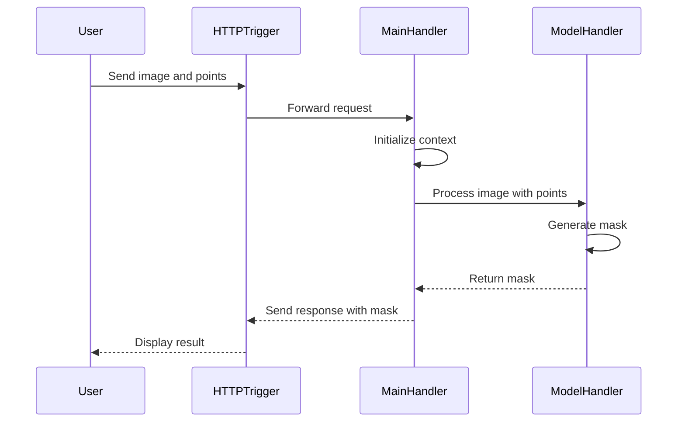

# CVAT - Anotação Automática e Interativa com YOLOv3, DEXTR, SAM 1 e SAM 2 via Docker + Nuclio

Este repositório configura localmente o **CVAT** com suporte a **anotação automática e interativa**, utilizando modelos de deep learning como **YOLOv3**, **DEXTR**, **SAM 1**, e **SAM 2**, integrados via **Nuclio**. Inclui volume compartilhado (`/mnt/share`), cloud storage com MinIO (`http://minio:9000`), e suporte a GPUs. Os arquivos de configuração (`docker-compose.yml`, `docker-compose.serverless.yml`, `docker-compose.custom.override.yml`) estão incluídos.

## 🚀 Pré-requisitos

- **Docker** e **Docker Compose** instalados.
- Sistema operacional: Ubuntu 20.04+, WSL2, ou Mac.
- **GPU** com NVIDIA Container Toolkit (para SAM 1 e SAM 2).
- Acesso à rede local (ex.: `192.168.1.15`) para o CVAT.
- Diretórios `/mnt/share` e `/mnt/minio-data` criados no host.
- Mínimo de 8 GB RAM e 20 GB de armazenamento.

## 📦 Clonando o Repositório

```bash
git clone https://github.com/renatowow14/cvat.git
cd cvat
```

## ⚙️ Subindo o CVAT com Modelos Serverless

Os arquivos `docker-compose.yml`, `docker-compose.serverless.yml`, e `docker-compose.custom.override.yml` configuram o CVAT com modelos (YOLOv3, DEXTR, SAM 1, SAM 2), IPs fixos, volume compartilhado, e cloud storage. Para subir:

```bash
docker compose -f docker-compose.yml -f components/serverless/docker-compose.serverless.yml -f docker-compose.custom.override.yml up -d --build
```

> ⚠️ Aguarde o download e inicialização dos containers (pode levar alguns minutos).

## 🌐 Expondo o CVAT para a Rede Local (WAN)

Para acessar o CVAT via `http://192.168.1.15:8080`:

1. **Configuração no `docker-compose.yml`**:
   - **cvat_server**:
     ```yaml
     labels:
       traefik.enable: "true"
       traefik.http.services.cvat.loadbalancer.server.port: "8080"
       traefik.http.routers.cvat.rule: PathPrefix(`/api/`) || PathPrefix(`/static/`) || PathPrefix(`/admin`) || PathPrefix(`/django-rq`)
       traefik.http.routers.cvat.entrypoints: web
     ```
   - **cvat_ui**:
     ```yaml
     labels:
       traefik.enable: "true"
       traefik.http.services.cvat-ui.loadbalancer.server.port: "80"
       traefik.http.routers.cvat-ui.rule: PathPrefix(`/`)
       traefik.http.routers.cvat-ui.entrypoints: web
     ```

2. **Portas no `docker-compose.custom.override.yml`**:
   ```yaml
   traefik:
     ports:
       - 8080:8080
       - 8090:8090
   ```

3. **Sub-rede no `docker-compose.custom.override.yml`**:
   ```yaml
   networks:
     cvat:
       driver: bridge
       ipam:
         config:
           - subnet: 172.20.0.0/24
   ```

4. **Reiniciar os Serviços**:
   ```bash
   docker compose -f docker-compose.yml -f docker-compose.serverless.yml -f docker-compose.custom.override.yml down
   docker compose -f docker-compose.yml -f docker-compose.serverless.yml -f docker-compose.custom.override.yml up -d --build
   ```

Acesse: `http://192.168.1.15:8080`

## 📋 Lista de Containers e IPs

Containers na rede `cvat_cvat` (`172.20.0.0/24`):

| Container                     | IP             | Portas Publicadas         | Estado         |
|------------------------------|----------------|---------------------------|----------------|
| `cvat_clickhouse`            | `172.20.0.2`   | -                         | running        |
| `cvat_db`                    | `172.20.0.3`   | -                         | running        |
| `nuclio`                     | `172.20.0.5`   | `8070:8070`               | healthy        |
| `traefik`                    | `172.20.0.6`   | `8080:8080`, `8090:8090`  | running        |
| `cvat_redis_inmem`           | `172.20.0.7`   | -                         | running        |
| `cvat_opa`                   | `172.20.0.8`   | -                         | running        |
| `cvat_vector`                | `172.20.0.9`   | -                         | running        |
| `cvat_grafana`               | `172.20.0.10`  | -                         | running        |
| `cvat_redis_ondisk`          | `172.20.0.11`  | -                         | healthy        |
| `cvat_worker_utils`          | `172.20.0.12`  | -                         | running        |
| `cvat_worker_export`         | `172.20.0.13`  | -                         | running        |
| `cvat_worker_webhooks`       | `172.20.0.14`  | -                         | running        |
| `cvat_worker_import`         | `172.20.0.15`  | -                         | running        |
| `cvat_worker_annotation`     | `172.20.0.16`  | -                         | running        |
| `cvat_worker_quality_reports`| `172.20.0.17`  | -                         | running        |
| `cvat_ui`                    | `172.20.0.18`  | -                         | running        |
| `cvat_worker_chunks`         | `172.20.0.19`  | -                         | running        |
| `minio`                      | `172.20.0.20`  | `9000:9000`, `9001:9001`  | running        |
| `cvat_worker_consensus`      | `172.20.0.21`  | -                         | running        |
| `nuclio-local-storage-reader`| `172.20.0.22`  | -                         | running        |
| `cvat_server`                | `172.20.0.30`  | -                         | running        |

> **Nota**: O container `portainer` (opcional) está na rede `bridge` com IP `172.17.0.2` e portas `8000:8000`, `9443:9443`.

## 📂 Configuração de Volume Compartilhado (`/mnt/share`)

Para facilitar importação/exportação de dados:

1. **Criar o Diretório**:
   ```bash
   mkdir -p /mnt/share
   chmod 777 /mnt/share
   ```

2. **Configuração no `docker-compose.custom.override.yml`**:
   ```yaml
   services:
     cvat_worker_utils:
       volumes:
         - cvat_share:/home/django/share:ro
     cvat_worker_export:
       volumes:
         - cvat_share:/home/django/share:ro
     cvat_worker_webhooks:
       volumes:
         - cvat_share:/home/django/share:ro
     cvat_worker_import:
       volumes:
         - cvat_share:/home/django/share:ro
     cvat_worker_quality_reports:
       volumes:
         - cvat_share:/home/django/share:ro
     cvat_worker_annotation:
       volumes:
         - cvat_share:/home/django/share:ro
     cvat_worker_chunks:
       volumes:
         - cvat_share:/home/django/share:ro
     cvat_worker_consensus:
       volumes:
         - cvat_share:/home/django/share:ro
   volumes:
     cvat_share:
       driver_opts:
         type: none
         device: /mnt/share
         o: bind
   ```

3. **Subir o CVAT**:
   ```bash
   docker compose -f docker-compose.yml -f docker-compose.serverless.yml -f docker-compose.custom.override.yml up -d --build
   ```

4. **Testar o Volume**:
   ```bash
   echo "🔥 Teste de volume OK" > /mnt/share/teste.txt
   docker exec -it cvat_worker_annotation cat /home/django/share/teste.txt
   ```

## ☁️ Configuração do Cloud Storage com MinIO

1. **Configuração no `docker-compose.custom.override.yml`**:
   ```yaml
   minio:
     container_name: minio
     image: minio/minio:latest
     restart: always
     ports:
       - 9000:9000
       - 9001:9001
     environment:
       MINIO_ROOT_USER: minioadmin
       MINIO_ROOT_PASSWORD: minioadmin123
       MINIO_SERVER_URL: http://172.20.0.20:9000
     volumes:
       - /mnt/minio-data:/data
     command: server /data --console-address ":9001" --address ":9000"
     networks:
       cvat:
         ipv4_address: 172.20.0.20
   ```

2. **Criar o Diretório**:
   ```bash
   mkdir -p /mnt/minio-data
   chmod 777 /mnt/minio-data
   ```

3. **Instalar o MinIO Client (`mc`)**:
   ```bash
   curl https://dl.min.io/client/mc/release/linux-amd64/mc -o mc
   chmod +x mc
   sudo mv mc /usr/local/bin/
   mc --version
   ```

4. **Configurar o Cloud Storage no CVAT**:
   - Acesse `http://192.168.1.15:8080` > **Cloud Storages** > **Add Cloud Storage**.
   - Preencha:
     - **Display name**: `minio-cvat-storage`
     - **Provider**: `Amazon S3`
     - **Bucket name**: `cvat-storage`
     - **Access key ID**: `minioadmin`
     - **Secret access key**: `minioadmin123`
     - **Endpoint URL**: `http://minio:9000`
     - **Region**: `us-east-1`
   - Clique em **Test Connection** e **Submit**.

5. **Configurar a Política do Bucket**:
   ```bash
   mc alias set myminio http://192.168.1.15:9000 minioadmin minioadmin123
   mc policy set public myminio/cvat-storage
   ```

6. **Testar Upload**:
   ```bash
   mc cp /mnt/share/images/*.jpg myminio/cvat-storage/
   mc ls myminio/cvat-storage
   ```

7. **Criar Tarefa com Cloud Storage**:
   - No CVAT, clique em **Create New Task**:
     - **Name**: `Teste MinIO`
     - **Labels**: `object`
     - **Source Storage**: **Cloud Storage** > `minio-cvat-storage`
   - Clique em **Submit & Open**.

## 🔑 Criando Usuário Administrador

```bash
docker exec -it cvat_server bash -ic 'python3 manage.py createsuperuser'
```

## 🔎 Acessando o CVAT

Acesse: `http://192.168.1.15:8080`

## 📥 Instalação do Nuclio CLI (`nuctl`)

```bash
curl -Lo nuctl https://github.com/nuclio/nuclio/releases/download/1.13.23/nuctl-1.13.23-linux-amd64
chmod +x nuctl
sudo mv nuctl /usr/local/bin/
nuctl version
```

## 💻 Instalação de Drivers NVIDIA + CUDA Toolkit

Para SAM 1 e SAM 2:

```bash
apt install ubuntu-drivers-common -y
ubuntu-drivers devices
sudo apt install nvidia-driver-550 -y

distribution=$(. /etc/os-release; echo $ID$VERSION_ID)
curl -s -L https://nvidia.github.io/libnvidia-container/gpgkey | sudo gpg --dearmor -o /usr/share/keyrings/nvidia-container-toolkit-keyring.gpg
curl -s -L https://nvidia.github.io/libnvidia-container/$distribution/libnvidia-container.list \
  | sed 's#deb https://#deb [signed-by=/usr/share/keyrings/nvidia-container-toolkit-keyring.gpg] https://#' \
  | sudo tee /etc/apt/sources.list.d/nvidia-container-toolkit.list > /dev/null
sudo apt update
sudo apt install -y nvidia-container-toolkit
sudo nvidia-ctk runtime configure --runtime=docker
sudo systemctl restart docker

sudo apt-get install gcc -y

wget https://developer.download.nvidia.com/compute/cuda/repos/ubuntu2404/x86_64/cuda-keyring_1.1-1_all.deb
sudo dpkg -i cuda-keyring_1.1-1_all.deb
sudo apt-get update
sudo apt-get -y install cuda-toolkit-12-8

export PATH=/usr/local/cuda/bin${PATH:+:$PATH}
export LD_LIBRARY_PATH=/usr/local/cuda-12.2/lib64${LD_LIBRARY_PATH:+:$PATH}

nvcc -V
```

## 🤖 Deploy dos Modelos YOLOv3 e DEXTR (CPU)

```bash
./serverless/deploy_cpu.sh serverless/openvino/dextr
./serverless/deploy_cpu.sh serverless/openvino/omz/public/yolo-v3-tf
```

## 🧠 Deploy do SAM 1 (GPU)

```bash
./serverless/deploy_gpu.sh serverless/pytorch/facebookresearch/sam
docker compose -f docker-compose.yml -f components/serverless/docker-compose.serverless.yml -f docker-compose.custom.override.yml restart
```

## 🧪 Deploy do SAM 2

O SAM 2 é configurado em duas pastas:

- **`sam2/nuclio`**: Arquivos originais, usando `sam2_hiera_large.pt` com `SAM2ImagePredictor`. Requer GPU com 8 GB+ VRAM (ex.: RTX 3060). Inviável na GTX 1050 Ti (3.93 GiB VRAM).
- **`sam2_custom/nuclio`**: Arquivos modificados, otimizados para GTX 1050 Ti, usados nos testes bem-sucedidos com `dog.jpg` (5184x3888 pixels), gerando máscara `semi-auto` e bounding box `auto`. Veja `README_custom.md`.

### Deploy do SAM 2 Original (sam2/nuclio, GPU Potente)

1. **Verificar Arquivos**:
   - Confirme que `sam2/nuclio` contém:
     - `function-gpu.yaml`: Configura `sam2_hiera_large.pt`, sem `opencv-python` ou `sam2_hiera_t.yaml`.
     - `main.py`: Usa `PIL`, exige `pos_points`/`neg_points`, sem segmentação automática.
     - `model_handler.py`: Usa `SAM2ImagePredictor`, processa imagens na resolução nativa.
   - Estrutura:
     ```
     sam2/
       └── nuclio/
           ├── function-gpu.yaml
           ├── main.py
           ├── model_handler.py
     ```

2. **Implantar**:
   - Remova a função existente:
     ```bash
     nuctl delete function sam2-tce --namespace cvat
     ```
   - Limpe o cache:
     ```bash
     docker builder prune -f
     ```
   - Implante:
     ```bash
     cd /root/cvat_renato/cvat
     ./deploy_gpu.sh sam2/nuclio --build
     ```
   - Reinicie o CVAT:
     ```bash
     docker compose -f docker-compose.yml -f docker-compose.serverless.yml -f docker-compose.custom.override.yml restart
     ```
   - Verifique os logs:
     ```bash
     docker logs $(docker ps -q --filter "name=nuclio-sam2")
     ```

3. **Testar**:
   - Suba uma imagem moderada (ex.: 1024x1024):
     ```bash
     convert /mnt/share/images/dog.jpg -resize 1024x1024 dog_resized.jpg
     mc cp dog_resized.jpg myminio/cvat-storage/
     ```
   - Crie uma tarefa no CVAT (`http://192.168.1.15:8080`):
     - Nome: `Teste SAM2 Original`
     - Label: `dog` (polygon)
     - Source: `minio-cvat-storage`, selecione `dog_resized.jpg`
     - Use **Interact** com SAM 2 (`nuclio-sam2`), fornecendo pontos positivos/negativos.
     - Exporte o XML e verifique a máscara.

> ⚠️ Requer GPU com 8 GB+ VRAM (ex.: RTX 3060). Não funciona na GTX 1050 Ti devido ao alto consumo de VRAM (~8-12 GB).

### Deploy do SAM 2 Custom (sam2_custom/nuclio, GTX 1050 Ti)

Os arquivos em `sam2_custom/nuclio` foram modificados para viabilizar o SAM 2 na GTX 1050 Ti, como comprovado no teste com `dog.jpg`. Veja `README_custom.md` para detalhes completos.

1. **Implantar**:
   - Remova a função existente:
     ```bash
     nuctl delete function sam2-tce --namespace cvat
     ```
   - Limpe o cache:
     ```bash
     docker builder prune -f
     ```
   - Implante:
     ```bash
     cd cvat/sam2_custom
     ./deploy_gpu.sh sam2/nuclio --build
     ```
   - Reinicie o CVAT:
     ```bash
     docker compose -f docker-compose.yml -f docker-compose.serverless.yml -f docker-compose.custom.override.yml restart
     ```
   - Verifique os logs:
     ```bash
     docker logs $(docker ps -q --filter "name=nuclio-sam2")
     ```

2. **Testar**:
   - Suba uma imagem pequena:
     ```bash
     convert /mnt/share/images/dog.jpg -resize 128x128 dog_tiny.jpg
     mc cp dog_tiny.jpg myminio/cvat-storage/
     ```
   - Crie uma tarefa no CVAT:
     - Nome: `Teste SAM2 Custom`
     - Label: `dog` (polygon)
     - Source: `minio-cvat-storage`, selecione `dog_tiny.jpg`
     - Use **Interact** com SAM 2 (`nuclio-sam2`).
     - Exporte o XML e verifique a máscara.

## 📈 Detalhes da Integração do SAM 2

### Passo a Passo
A função SAM 2 é integrada ao CVAT via Nuclio com suporte a GPU. Ela recebe uma imagem e pontos (ou caixa), executa o modelo SAM 2, gera a máscara, e retorna a resposta ao CVAT.

### Arquivos (sam2/nuclio - Original)
| Arquivo/Função       | Descrição                                                                 |
|---------------------|---------------------------------------------------------------------------|
| `function-gpu.yaml` | Configura a função Nuclio: imagem base, runtime, handler, GPU, variáveis ENV |
| `main.py`           | Recebe imagem/pontos via HTTP e chama `ModelHandler`                     |
| `model_handler.py`  | Executa inferência com `SAM2ImagePredictor` e `sam2_hiera_large.pt`       |

### Arquivos (sam2_custom/nuclio - Custom)
Veja `README_custom.md` para detalhes das modificações.

### Diagrama de Sequência



### Comparativo com SAM 1

| Item                  | SAM 1                              | SAM 2 (Original)                   | SAM 2 (Custom)                     |
|-----------------------|------------------------------------|------------------------------------|------------------------------------|
| Modelo                | SAM (v1)                          | `sam2_hiera_large.pt`             | `sam2_hiera_tiny.pt`              |
| Framework             | PyTorch + CUDA 11                 | `SAM2ImagePredictor` (CUDA 12.4)  | `SAM2AutomaticMaskGenerator`       |
| Bounding Box          | ❌ Somente pontos                 | ✅ Pontos + caixa                 | ✅ Pontos + caixa + automática     |
| VRAM                  | 6-8 GB                            | 8-12 GB                           | 2-3 GB                            |
| Compatibilidade       | GPU potente                       | GPU potente                       | GTX 1050 Ti e GPUs potentes       |

## 🧑‍💻 Usando a Anotação Automática/Interativa

1. Crie uma tarefa no CVAT.
2. Faça upload de imagens via `/mnt/share` ou `minio-cvat-storage`.
3. Crie um label (ex.: `dog`).
4. Acesse o Job.
5. Para anotação interativa:
   - Use **Polygon** ou **Rectangle**.
   - Clique em **Interact** (varinha mágica) ou pressione **M**.
   - Escolha `nuclio-sam2`, clique em pontos, e clique em **Apply**.
6. Para anotação automática:
   - Clique em **Actions > Automatic Annotation**.
   - Escolha `nuclio-sam2`, mapeie labels, e clique em **Annotate**.
7. Salve as anotações.

## 📄 Exportando Anotações

- Clique em **Actions > Export annotations**.
- Escolha o formato (ex.: CVAT XML, COCO).

## 🛠️ Resolução de Problemas

### 1. Erro `Address already in use`
- **Causa**: Portas 8080 ou 8090 em uso.
- **Solução**:
  ```bash
  sudo netstat -tulnp | grep 8080
  sudo kill -9 <PID>
  docker compose -f docker-compose.yml -f docker-compose.serverless.yml -f docker-compose.custom.override.yml up -d
  ```

### 2. Cloud Storage Não Conecta
- **Causa**: Configuração incorreta do MinIO.
- **Solução**:
  ```bash
  mc alias ls
  mc alias set myminio http://192.168.1.15:9000 minioadmin minioadmin123
  ```

### 3. Modelo Não Aparece no Menu
- **Causa**: Função não registrada no Nuclio.
- **Solução**:
  ```bash
  nuctl get functions --namespace cvat
  nuctl delete function sam2-tce --namespace cvat
  ./deploy_gpu.sh sam2_custom/nuclio --build
  ```

### 4. Erro `CUDA out of memory` (SAM 1 ou SAM 2)
- **Causa**: VRAM insuficiente (ex.: GTX 1050 Ti, 3.93 GiB).
- **Solução**:
  ```bash
  nvidia-smi
  sudo kill -9 <PID>
  convert /mnt/share/images/dog.jpg -resize 128x128 dog_tiny.jpg
  mc cp dog_tiny.jpg myminio/cvat-storage/
  sudo systemctl restart docker
  ```
  - Para SAM 2, use `sam2_custom/nuclio`.

### 5. Bounding Box `auto` Inesperada
- **Causa**: CVAT gera bounding boxes `auto` a partir de máscaras `semi-auto`, como no teste com `dog.jpg`.
- **Solução**:
  ```bash
  nuctl get functions --namespace cvat
  docker logs cvat_server | grep -i auto
  convert /mnt/share/images/dog.jpg -resize 128x128 dog_tiny2.jpg
  mc cp dog_tiny2.jpg myminio/cvat-storage/
  ```
  - Ajuste as configurações da tarefa no CVAT para desativar bounding boxes automáticas, se desejar.

### 6. Erro `HTTPConnectionPool(host='host.docker.internal', port=...)`
- **Causa**: CVAT usa `host.docker.internal` em vez do IP interno.
- **Solução**:
  - Edite `docker-compose.serverless.yml`:
    ```yaml
    services:
      cvat_server:
        environment:
          - CVAT_SERVERLESS=1
          - NUCLIO_FUNCTION_ENDPOINT=http://172.20.0.5:8070/api/functions
          - CVAT_LAMBDA_ENDPOINT=http://172.20.0.25:8080
    ```
  - Reinicie:
    ```bash
    docker compose -f docker-compose.yml -f docker-compose.serverless.yml -f docker-compose.custom.override.yml down
    docker compose -f docker-compose.yml -f docker-compose.serverless.yml -f docker-compose.custom.override.yml up -d
    ```

## 📚 Referências

- [CVAT Docs](https://docs.cvat.ai/)
- [Nuclio Docs](https://nuclio.io/docs/latest/)
- [Segment Anything v1](https://github.com/facebookresearch/segment-anything)
- [Segment Anything v2](https://github.com/facebookresearch/segment-anything-2)
- [MinIO Client](https://min.io/docs/minio/linux/reference/minio-mc.html)

## 🤝 Agradecimentos

Agradecimentos à comunidade CVAT, especialmente ao pull request [#8243](https://github.com/opencv/cvat/pull/8243) liderado por @jeanchristopheruel, que inspirou a integração do SAM 2.

## ✅ Checklist Geral do Projeto

### 🔧 Instalação e Configuração Base
- [x] Clonagem do repositório com arquivos de configuração
- [x] Uso do `docker-compose.yml`, `docker-compose.serverless.yml`, e `docker-compose.custom.override.yml`
- [x] Configuração do Traefik para acesso via `http://192.168.1.15:8080`
- [x] Resolução de conflitos de IPs com sub-rede `172.20.0.0/24`
- [x] Criação de superusuário Django via `cvat_server`
- [x] Instalação do CLI `nuctl`
- [x] Instalação dos drivers NVIDIA, CUDA Toolkit, e NVIDIA Container Toolkit

### 🧠 Deploy dos Modelos Padrão
- [x] Deploy do **YOLOv3** com `deploy_cpu.sh`
- [x] Deploy do **DEXTR** com `deploy_cpu.sh`
- [x] Deploy do **SAM 1** com `deploy_gpu.sh`

### 🚀 Integração e Deploy do SAM 2
- [x] Inclusão dos arquivos originais em `sam2/nuclio`:
  - `function-gpu.yaml`
  - `main.py`
  - `model_handler.py`
- [x] Inclusão dos arquivos customizados em `sam2_custom/nuclio`:
  - `function-gpu.yaml` (com `sam2_hiera_tiny.pt`, `opencv-python`, `sam2_hiera_t.yaml`, `PYTORCH_CUDA_ALLOC_CONF`)
  - `main.py` (base64, segmentação automática, validações)
  - `model_handler.py` (`SAM2AutomaticMaskGenerator`, redimensionamento, `torch.cuda.empty_cache()`)
- [x] Configuração de variáveis `ENV` no `function-gpu.yaml` (`MODEL`, `MODEL_CFG`)
- [x] Suporte a CUDA 12.4 via imagem base `pytorch/pytorch:2.4.0-cuda12.4-cudnn9-devel`
- [x] Adição de suporte a **Bounding Box to Mask** (custom)
- [x] Testes bem-sucedidos com `dog.jpg` (5184x3888) usando `sam2_custom/nuclio`, gerando máscara `semi-auto` e bounding box `auto`
- [x] Reinício do CVAT para integração
- [x] Verificação de logs e funcionamento no CVAT

### 📂 Volume Compartilhado
- [x] Criação do volume `cvat_share` com bind para `/mnt/share`
- [x] Configuração no `docker-compose.custom.override.yml`
- [x] Montagem nos containers (`cvat_worker_*`)
- [x] Teste de leitura/escrita com `echo` e `cat`
- [x] Permissões aplicadas: `chmod 777 /mnt/share`

### ☁️ Cloud Storage (MinIO)
- [x] Configuração do serviço `minio` com IP `172.20.0.20`
- [x] Instalação do MinIO Client (`mc`)
- [x] Criação do bucket `cvat-storage`
- [x] Configuração do cloud storage no CVAT
- [x] Teste de upload e criação de tarefa com imagens do MinIO
