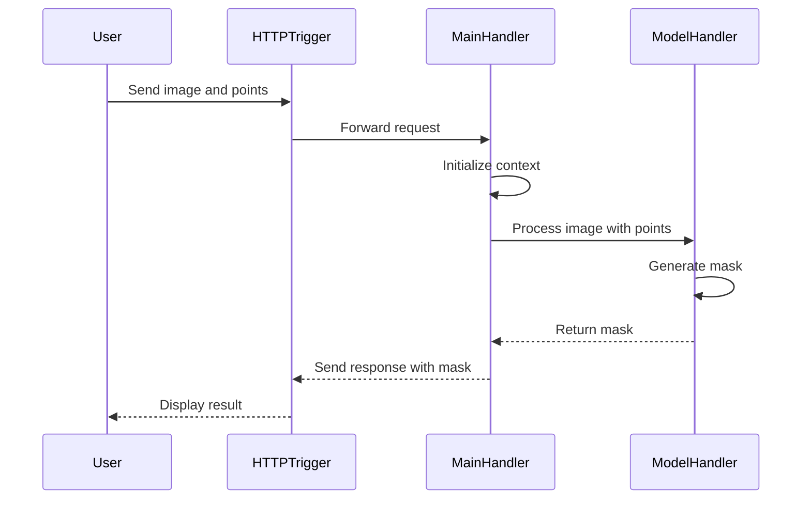

# CVAT - Anotação Automática com YOLOv3, DEXTR, SAM 1 e SAM 2 via Docker + Nuclio

Este repositório/documentação demonstra como configurar localmente o **CVAT** com suporte à **anotação automática e assistida**, utilizando modelos baseados em deep learning como **YOLOv3**, **DEXTR**, **SAM 1** e **SAM 2**, integrados via **Nuclio**.

---

## 🚀 Pré-requisitos

- Docker + Docker Compose instalados
- Sistema operacional compatível (Ubuntu 20.04+, WSL2 ou Mac)
- GPU + NVIDIA Container Toolkit (necessário para SAM 1 e SAM 2)

---

## 📦 Clonando o repositório

```bash
git clone https://github.com/opencv/cvat
cd cvat
```

---

## ⚙️ Subindo o CVAT com suporte a modelos serverless

Utilizar o `docker-compose.serverless.yml` para ativar os modelos automáticos (YOLO, DEXTR, SAM, etc):

```bash
docker compose -f docker-compose.yml -f components/serverless/docker-compose.serverless.yml up -d --build
```

> ⚠️ É necessário aguardar o download e inicialização de todos os containers (pode levar alguns minutos na primeira execução).

---

## 🌐 Expondo o CVAT para a rede local (WAN)

Por padrão, o CVAT escuta apenas no `localhost`. Para permitir o acesso a partir de outros dispositivos da rede (como `http://192.168.1.15:8080`):

1. No arquivo `docker-compose.yml`, ajustar os blocos de labels:

### `cvat_server`:
```yaml
labels:
  traefik.enable: "true"
  traefik.http.services.cvat.loadbalancer.server.port: "8080"
  traefik.http.routers.cvat.rule: PathPrefix(`/api/`) || PathPrefix(`/static/`) || PathPrefix(`/admin`) || PathPrefix(`/django-rq`)
  traefik.http.routers.cvat.entrypoints: web
```

### `cvat_ui`:
```yaml
labels:
  traefik.enable: "true"
  traefik.http.services.cvat-ui.loadbalancer.server.port: "80"
  traefik.http.routers.cvat-ui.rule: PathPrefix(`/`)
  traefik.http.routers.cvat-ui.entrypoints: web
```

2. Garantir que o serviço `traefik` esteja expondo as portas corretamente:
```yaml
ports:
  - 8080:8080
```

3. Reiniciar os serviços:
```bash
docker compose down -v
docker compose -f docker-compose.yml -f components/serverless/docker-compose.serverless.yml up -d --build
```

A partir disso, o acesso poderá ser realizado via IP da máquina:
```
http://192.168.1.15:8080
```

---

## 🔑 Criando usuário administrador

```bash
docker exec -it cvat_server bash -ic 'python3 manage.py createsuperuser'
```

---

## 🔎 Acessando o CVAT

```
http://192.168.1.15:8080
```

---

## 📥 Instalação do Nuclio CLI (`nuctl`)

```bash
curl -Lo nuctl https://github.com/nuclio/nuclio/releases/download/1.13.23/nuctl-1.13.23-linux-amd64
chmod +x nuctl
sudo mv nuctl /usr/local/bin/
nuctl version
```

> 💡 O comando `nuctl` precisa estar disponível no terminal antes de executar os scripts de deploy.

---

## 💻 Instalação de drivers NVIDIA + CUDA Toolkit (para SAM 1 e SAM 2)

```bash
apt install ubuntu-drivers-common -y
ubuntu-drivers devices
sudo apt install nvidia-driver-550 -y

distribution=$(. /etc/os-release; echo $ID$VERSION_ID)
curl -s -L https://nvidia.github.io/libnvidia-container/gpgkey | sudo gpg --dearmor -o /usr/share/keyrings/nvidia-container-toolkit-keyring.gpg
curl -s -L https://nvidia.github.io/libnvidia-container/$distribution/libnvidia-container.list \
  | sed 's#deb https://#deb [signed-by=/usr/share/keyrings/nvidia-container-toolkit-keyring.gpg] https://#' \
  | sudo tee /etc/apt/sources.list.d/nvidia-container-toolkit.list > /dev/null
sudo apt update
sudo apt install -y nvidia-container-toolkit
sudo nvidia-ctk runtime configure --runtime=docker
sudo systemctl restart docker

sudo apt-get install gcc -y

wget https://developer.download.nvidia.com/compute/cuda/repos/ubuntu2404/x86_64/cuda-keyring_1.1-1_all.deb
sudo dpkg -i cuda-keyring_1.1-1_all.deb
sudo apt-get update
sudo apt-get -y install cuda-toolkit-12-8

export PATH=/usr/local/cuda/bin${PATH:+:$PATH}
export LD_LIBRARY_PATH=/usr/local/cuda-12.2/lib64${LD_LIBRARY_PATH:+:$LD_LIBRARY_PATH}

nvcc -V
```

---

## 🤖 Deploy dos modelos YOLOv3 e DEXTR (CPU)

```bash
./serverless/deploy_cpu.sh serverless/openvino/dextr
./serverless/deploy_cpu.sh serverless/openvino/omz/public/yolo-v3-tf
```

---

## 🧠 Deploy do SAM 1 (GPU)

```bash
./serverless/deploy_gpu.sh serverless/pytorch/facebookresearch/sam
docker compose restart
```

---

## 🧪 Deploy do SAM 2 (custom, GPU)

1. Clonar ou copiar os arquivos `function-gpu.yaml`, `main.py`, `model_handler.py` para uma pasta:

```
sam2/
  └── nuclio/
      ├── function-gpu.yaml
      ├── main.py
      ├── model_handler.py
```

2. Executar:
```bash
./deploy_gpu.sh sam2/nuclio
docker compose restart
```

> O modelo `nuclio-sam2` aparecerá no menu **Actions > Automatic Annotation**.

---

## 📈 Detalhes da Integração do SAM 2 no CVAT

### Passo a passo

A função personalizada para o SAM 2 foi integrada ao CVAT utilizando Nuclio com suporte à GPU. A função recebe uma imagem e pontos de segmentação, executa o modelo SAM 2, gera a máscara e retorna a resposta ao CVAT. Essa integração melhora a acessibilidade à segmentação avançada de imagens.

### Mudanças

| Arquivos/Funções                                             | Descrição                                                                                         |
|--------------------------------------------------------------|---------------------------------------------------------------------------------------------------|
| `function-gpu.yaml`                                          | Define imagem base, runtime, variáveis, handler, trigger HTTP e uso de GPU                       |
| `main.py`                                                    | Implementa a função Nuclio com `init_context` e `handler` para processar imagem e retornar máscara |
| `model_handler.py`                                           | Classe `ModelHandler` para carregar modelo e gerar máscara com base nos pontos recebidos         |
| `requirements.txt`                                           | Lista bibliotecas adicionais necessárias para a função funcionar corretamente                     |

### ⚙️ Diferenciais desta implementação (SAM 2)

| Recurso                          | Descrição                                                                 |
|----------------------------------|---------------------------------------------------------------------------|
| ✅ ENV configuráveis             | Permite trocar facilmente o modelo e config (`MODEL`, `MODEL_CFG`)       |
| ✅ Bounding Box to Mask          | Suporte a caixas iniciais para gerar segmentações mais precisas          |
| ✅ Compatível com CVAT + Nuclio  | Deploy simples via `deploy_gpu.sh` com `function-gpu.yaml` específico    |
| 🧠 Baseada em SAM1               | Estrutura de função herdada do `serverless/pytorch/facebookresearch/sam` |

---

### ✨ Comparativo com o SAM 1

| Item                         | SAM 1                                      | SAM 2 (custom adaptado)                      |
|------------------------------|---------------------------------------------|----------------------------------------------|
| Modelo base                  | SAM (v1)                                    | Segment Anything 2 (v2)                      |
| Bounding Box suporte         | ❌ Somente pontos                           | ✅ Bounding Box + pontos                     |
| Variáveis de ambiente        | ❌ Fixas                                    | ✅ `MODEL` e `MODEL_CFG`                     |
| Arquitetura Nuclio           | ✅ Pronta                                   | ✅ Adaptada a partir do SAM1                 |
| Imagem base CUDA             | `cuda11`                                    | `cuda12.4`, compatível com PyTorch 2.4       |

---

### 🤝 Agradecimentos

A adaptação do SAM2 foi baseada em contribuições da comunidade, especialmente nos pull requests da [issue #8243](https://github.com/opencv/cvat/pull/8243), liderada por @jeanchristopheruel, que tornou possível integrar o Segment Anything 2 ao ecossistema CVAT Open Source.

### Diagrama de Sequência



---
---

## 🧑‍💻 Usando a anotação automática na interface

1. Criar uma `Task`
2. Fazer upload de imagens
3. Criar um label (ex: `person`)
4. Acessar o Job
5. Clicar em `Actions → Automatic Annotation`
6. Escolher o modelo
7. Mapear os labels e clicar em **Annotate**
8. Clicar em **Save**

---

## 📄 Exportando anotações

- `Actions → Export annotations`
- Formatos suportados: COCO, YOLO, Pascal VOC, XML, etc.

---

## 📊 Comparativo de Modelos

| Modelo  | Tipo       | Suporte     | Framework       | Recurso | Labels | Tipos de tarefa |
|---------|------------|-------------|------------------|---------|--------|-----------------|
| YOLOv3  | Detecção   | Oficial     | OpenVINO         | CPU     | person, car... | Caixa delimitadora |
| DEXTR   | Segmentação| Oficial     | OpenVINO         | CPU     | custom          | Segmentação interativa |
| SAM 1   | Segmentação| Oficial     | PyTorch + CUDA    | GPU     | custom          | Segmentação assistida |
| SAM 2   | Segmentação| Custom      | PyTorch 2.4 + CUDA 12.4 | GPU | custom          | Segmentação assistida |

---

Perfeito, vamos complementar a seção `## 🧪 Como foi feita a personalização do SAM 2 no CVAT` com base na **análise detalhada do segundo repositório** que você usou. Aqui está a nova versão, completa e clara:

---

## 🧪 Como foi feita a personalização do SAM 2 no CVAT

---

### 📁 Estrutura da função customizada
```
sam2/
  └── nuclio/
      ├── function-gpu.yaml       # Configuração da função Nuclio com GPU
      ├── main.py                 # Função HTTP Nuclio que executa a inferência
      ├── model_handler.py        # Classe que carrega o modelo e executa a predição
      └── requirements.txt        # Dependências da função (Torch, SAM2, etc)
```

---

### 🔧 `function-gpu.yaml`

- Define `baseImage: pytorch/pytorch:2.4.0-cuda12.4-cudnn9-devel`, conforme recomendado pela Meta para suporte ao SAM2
- Adiciona instruções `directives` para instalar pacotes via `apt`, baixar o modelo SAM2 e instalar bibliotecas com `pip`
- Usa `resources.limits.nvidia.com/gpu: 1` para garantir que a função utilize a GPU
- Usa variáveis de ambiente para parametrizar o modelo carregado:

```yaml
- kind: ENV
  value: MODEL="sam2_hiera_large.pt"
- kind: ENV
  value: MODEL_CFG="sam2_hiera_l.yaml"
```

Isso permite alternar entre diferentes variantes do SAM2 (tiny, small, base_plus, large) sem editar o código.

---

### 🧠 `main.py`

- Implementa o `handler()` que:
  - Recebe a imagem base64 + pontos positivos e negativos
  - Converte a imagem para RGB
  - (Opcionalmente) processa `obj_bbox` se fornecido
  - Chama `ModelHandler.handle()` e retorna a máscara gerada como resposta JSON
- Inclui tratamento de erro com `try/except`, garantindo respostas HTTP 500 bem formatadas em caso de falha

---

### 🧠 `model_handler.py`

- Usa `torch.cuda.is_available()` para detectar e utilizar GPU
- Carrega dinamicamente o modelo e a configuração definidos nas variáveis de ambiente
- Implementa:
  ```python
  def handle(image, pos_points, neg_points, obj_bbox=None)
  ```
  que realiza a inferência usando:
  ```python
  self.predictor.predict(...)
  ```
- Ordena as máscaras por `score`, retornando a melhor

- Se `obj_bbox` for fornecida, ela é utilizada como pista para refinar a segmentação, permitindo a funcionalidade de **Bounding Box to Mask**

---

### 💡 Destaques técnicos da adaptação

| Recurso                           | Implementado? | Detalhes                                                                 |
|----------------------------------|---------------|--------------------------------------------------------------------------|
| Suporte à GPU (CUDA 12.4)        | ✅            | Imagem `pytorch:2.4.0-cuda12.4-cudnn9-devel`                             |
| Deploy automático via script     | ✅            | Com `deploy_gpu.sh` e `nuctl`                                            |
| ENV para modelo/config           | ✅            | Com `MODEL` e `MODEL_CFG`                                               |
| Suporte a Bounding Box to Mask   | ✅            | Parametrizado via `obj_bbox` em `main.py` e `model_handler.py`          |
| Base SAM1 reaproveitada          | ✅            | Estrutura da função e lógica mantidas e adaptadas                       |
| Escalável e reutilizável         | ✅            | Pronto para automações futuras                                          |

---

## 📚 Referências

- [CVAT Docs](https://docs.cvat.ai/)
- [Nuclio Docs](https://nuclio.io/docs/latest/)
- [Segment Anything v1](https://github.com/facebookresearch/segment-anything)
- [Segment Anything v2](https://github.com/facebookresearch/segment-anything-2)

---

## ✅ TODO

- [ ] Automatizar deploy com Makefile
- [ ] Adicionar suporte ao modelo SAM-HQ
- [ ] Exportação com post-processamento customizado
