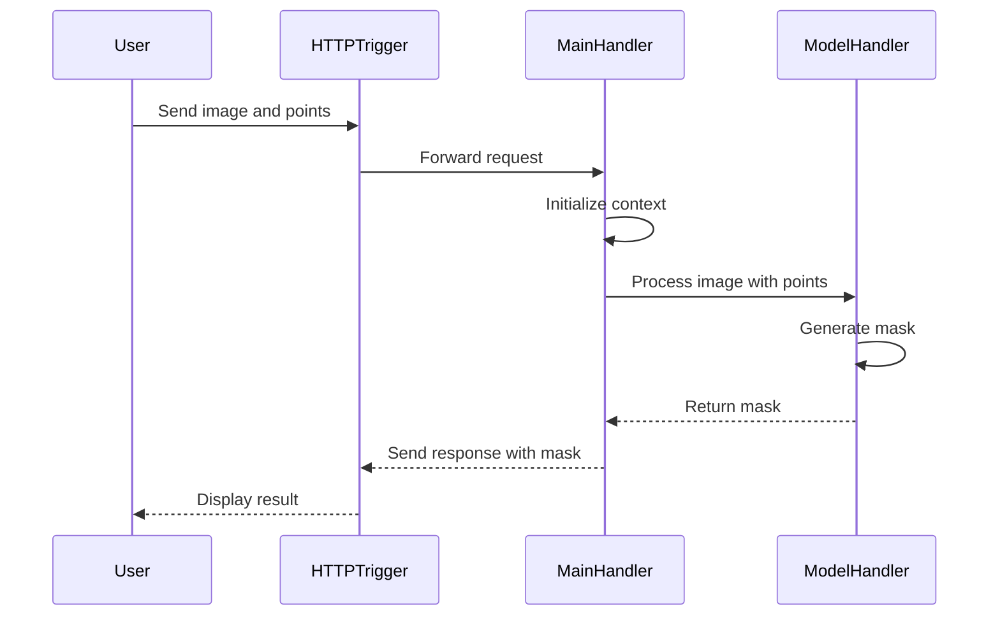

# CVAT - Anotação Automática com YOLOv3, DEXTR, SAM 1 e SAM 2 via Docker + Nuclio

Este repositório/documentação demonstra como configurar localmente o **CVAT** com suporte à **anotação automática e assistida**, utilizando modelos baseados em deep learning como **YOLOv3**, **DEXTR**, **SAM 1** e **SAM 2**, integrados via **Nuclio**. Inclui configuração de um volume compartilhado (`/mnt/share`) e cloud storage com MinIO (`http://minio:9000`).

---

## 🚀 Pré-requisitos

- Docker + Docker Compose instalados
- Sistema operacional compatível (Ubuntu 20.04+, WSL2 ou Mac)
- GPU + NVIDIA Container Toolkit (necessário para SAM 1 e SAM 2)
- Acesso à rede local (ex.: `192.168.1.15`) para exposição do CVAT
- Diretórios `/mnt/share` e `/mnt/minio-data` criados no host

---

## 📦 Clonando o repositório

```bash
git clone https://github.com/opencv/cvat
cd cvat
```

---

## ⚙️ Subindo o CVAT com suporte a modelos serverless

Utilize os arquivos `docker-compose.yml`, `docker-compose.serverless.yml` e `docker-compose.custom.override.yml` para ativar os modelos automáticos (YOLOv3, DEXTR, SAM 1, SAM 2) e configurar volumes compartilhados e cloud storage:

```bash
docker compose -f docker-compose.yml -f components/serverless/docker-compose.serverless.yml -f docker-compose.custom.override.yml up -d --build
```

> ⚠️ Aguarde o download e inicialização de todos os containers (pode levar alguns minutos na primeira execução).

---

## 🌐 Expondo o CVAT para a rede local (WAN)

Por padrão, o CVAT escuta apenas no `localhost`. Para permitir o acesso a partir de outros dispositivos da rede (ex.: `http://192.168.1.15:8080`):

1. No arquivo `docker-compose.yml`, confirme os blocos de labels:

### `cvat_server`:
```yaml
labels:
  traefik.enable: "true"
  traefik.http.services.cvat.loadbalancer.server.port: "8080"
  traefik.http.routers.cvat.rule: PathPrefix(`/api/`) || PathPrefix(`/static/`) || PathPrefix(`/admin`) || PathPrefix(`/django-rq`)
  traefik.http.routers.cvat.entrypoints: web
```

### `cvat_ui`:
```yaml
labels:
  traefik.enable: "true"
  traefik.http.services.cvat-ui.loadbalancer.server.port: "80"
  traefik.http.routers.cvat-ui.rule: PathPrefix(`/`)
  traefik.http.routers.cvat-ui.entrypoints: web
```

2. Confirme que o serviço `traefik` está expondo as portas corretamente:
```yaml
ports:
  - 8080:8080
  - 8090:8090
```

3. Confirme que a sub-rede está configurada para evitar conflitos de IPs:
```yaml
networks:
  cvat:
    driver: bridge
    ipam:
      config:
        - subnet: 172.20.0.0/24
```

4. Reinicie os serviços:

```bash
docker compose -f docker-compose.yml -f components/serverless/docker-compose.serverless.yml -f docker-compose.custom.override.yml down
docker compose -f docker-compose.yml -f components/serverless/docker-compose.serverless.yml -f docker-compose.custom.override.yml up -d --build
```

Acesse o CVAT via:

```
http://192.168.1.15:8080
```

---

## 📂 Configuração de volume compartilhado (`/mnt/share`)

***Referência: [Share Storage](https://docs.cvat.ai/docs/administration/basics/installation/#share-path)***

Para facilitar a **importação/exportação de dados** e permitir acesso a arquivos em múltiplos workers, configuramos um volume compartilhado entre os serviços do CVAT.

### 🛠️ Etapas de configuração

1. Crie o diretório compartilhado no host:

```bash
mkdir -p /mnt/share
chmod 777 /mnt/share
```

2. Confirme o arquivo `docker-compose.custom.override.yml`:

```yaml
services:
  cvat_server:
    volumes:
      - cvat_share:/home/django/share:ro

  cvat_worker_import:
    volumes:
      - cvat_share:/home/django/share:ro

  cvat_worker_export:
    volumes:
      - cvat_share:/home/django/share:ro

  cvat_worker_annotation:
    volumes:
      - cvat_share:/home/django/share:ro

  cvat_worker_chunks:
    volumes:
      - cvat_share:/home/django/share:ro

volumes:
  cvat_share:
    driver_opts:
      type: none
      device: /mnt/share
      o: bind
```

> 🔒 O uso de `:ro` (read-only) garante que os containers não modifiquem os arquivos do host acidentalmente.

3. Suba o CVAT com o override ativado:

```bash
docker compose -f docker-compose.yml -f components/serverless/docker-compose.serverless.yml -f docker-compose.custom.override.yml up -d --build
```

4. Verifique se o volume está montado corretamente:

```bash
docker exec -it cvat_server ls /home/django/share
```

5. Teste funcional:

```bash
echo "🔥 Teste de volume OK" > /mnt/share/teste.txt
docker exec -it cvat_server cat /home/django/share/teste.txt
```

> ✅ Você deverá ver a mensagem "🔥 Teste de volume OK", provando que o CVAT está lendo corretamente o conteúdo do volume compartilhado.

---

## ☁️ Configuração do Cloud Storage com MinIO

O CVAT suporta integração com cloud storage para gerenciar imagens e anotações. Configuramos o MinIO como provedor S3 local.

### 🛠️ Etapas de configuração

1. Confirme que o serviço `minio` está configurado no `docker-compose.yml`:

```yaml
minio:
  container_name: minio
  image: minio/minio:latest
  restart: always
  ports:
    - 9000:9000
    - 9001:9001
  environment:
    MINIO_ROOT_USER: minioadmin
    MINIO_ROOT_PASSWORD: minioadmin123
    MINIO_SERVER_URL: http://172.20.0.20:9000
  volumes:
    - /mnt/minio-data:/data
  command: server /data --console-address ":9001" --address ":9000"
  networks:
    cvat:
      ipv4_address: 172.20.0.20
      aliases:
        - minio
```

2. Crie o diretório para os dados do MinIO:

```bash
mkdir -p /mnt/minio-data
chmod 777 /mnt/minio-data
```

3. Acesse o CVAT e configure o cloud storage:

- Vá para **Cloud Storages** > **Add Cloud Storage**.
- Preencha:
  - **Display name**: `minio-cvat-storage`
  - **Description**: `MinIO local para CVAT`
  - **Provider**: `Amazon S3`
  - **Bucket name**: `cvat-storage`
  - **Authentication type**: `Access and secret keys`
  - **Access key ID**: `minioadmin`
  - **Secret access key**: `minioadmin123`
  - **Endpoint URL**: `http://minio:9000`
  - **Region**: `us-east-1`
  - **Prefix**: Deixe vazio
  - **Manifests**: Desmarcado
- Clique em **Test Connection** e, se funcionar, clique em **Submit**.

4. Configure a política do bucket:

```bash
mc alias set myminio http://192.168.1.15:9000 minioadmin minioadmin123
mc policy set public myminio/cvat-storage
```

5. Faça upload de imagens para teste:

```bash
mc cp /mnt/share/images/*.jpg myminio/cvat-storage/
mc ls myminio/cvat-storage
```

6. Crie uma tarefa usando o cloud storage:

- No CVAT, clique em **Create New Task**.
- Configure:
  - **Name**: `Teste MinIO`
  - **Labels**: `object`
  - **Source Storage**: **Cloud Storage** > `minio-cvat-storage`
- Clique em **Submit & Open**.
- Verifique se as imagens aparecem.

---

## 🔑 Criando usuário administrador

```bash
docker exec -it cvat_server bash -ic 'python3 manage.py createsuperuser'
```

---

## 🔎 Acessando o CVAT

```
http://192.168.1.15:8080
```

---

## 📥 Instalação do Nuclio CLI (`nuctl`)

```bash
curl -Lo nuctl https://github.com/nuclio/nuclio/releases/download/1.13.23/nuctl-1.13.23-linux-amd64
chmod +x nuctl
sudo mv nuctl /usr/local/bin/
nuctl version
```

> 💡 O comando `nuctl` precisa estar disponível no terminal antes de executar os scripts de deploy.

---

## 💻 Instalação de drivers NVIDIA + CUDA Toolkit (para SAM 1 e SAM 2)

```bash
apt install ubuntu-drivers-common -y
ubuntu-drivers devices
sudo apt install nvidia-driver-550 -y

distribution=$(. /etc/os-release; echo $ID$VERSION_ID)
curl -s -L https://nvidia.github.io/libnvidia-container/gpgkey | sudo gpg --dearmor -o /usr/share/keyrings/nvidia-container-toolkit-keyring.gpg
curl -s -L https://nvidia.github.io/libnvidia-container/$distribution/libnvidia-container.list \
  | sed 's#deb https://#deb [signed-by=/usr/share/keyrings/nvidia-container-toolkit-keyring.gpg] https://#' \
  | sudo tee /etc/apt/sources.list.d/nvidia-container-toolkit.list > /dev/null
sudo apt update
sudo apt install -y nvidia-container-toolkit
sudo nvidia-ctk runtime configure --runtime=docker
sudo systemctl restart docker

sudo apt-get install gcc -y

wget https://developer.download.nvidia.com/compute/cuda/repos/ubuntu2404/x86_64/cuda-keyring_1.1-1_all.deb
sudo dpkg -i cuda-keyring_1.1-1_all.deb
sudo apt-get update
sudo apt-get -y install cuda-toolkit-12-8

export PATH=/usr/local/cuda/bin${PATH:+:$PATH}
export LD_LIBRARY_PATH=/usr/local/cuda-12.2/lib64${LD_LIBRARY_PATH:+:$PATH}

nvcc -V
```

---

## 🤖 Deploy dos modelos YOLOv3 e DEXTR (CPU)

```bash
./serverless/deploy_cpu.sh serverless/openvino/dextr
./serverless/deploy_cpu.sh serverless/openvino/omz/public/yolo-v3-tf
```

---

## 🧠 Deploy do SAM 1 (GPU)

```bash
./serverless/deploy_gpu.sh serverless/pytorch/facebookresearch/sam
docker compose restart
```

---

## 🧪 Deploy do SAM 2 (custom, GPU)

1. Clone ou copie os arquivos `function-gpu.yaml`, `main.py`, `model_handler.py` para a pasta `sam2/nuclio`, e o script `deploy_gpu.sh` para o diretório raiz:

```
deploy_gpu.sh                # Script que faz o deploy da função via nuctl
sam2/
  └── nuclio/
      ├── function-gpu.yaml  # Configuração da função Nuclio (GPU, ENV, modelo)
      ├── main.py            # Função HTTP que trata a requisição do CVAT
      ├── model_handler.py   # Classe que roda a inferência do SAM2
```

2. Execute o script:

```bash
./deploy_gpu.sh sam2/nuclio
docker compose restart
```

> ✅ O modelo `nuclio-sam2` aparecerá no menu **Actions > Automatic Annotation** do CVAT automaticamente após o deploy.

---

## 📈 Detalhes da Integração do SAM 2 no CVAT

### Passo a passo

A função personalizada para o SAM 2 foi integrada ao CVAT utilizando Nuclio com suporte à GPU. A função recebe uma imagem e pontos de segmentação, executa o modelo SAM 2, gera a máscara e retorna a resposta ao CVAT. Essa integração melhora a acessibilidade à segmentação avançada de imagens.

### Mudanças

| Arquivo/Função                  | Descrição                                                                                         |
|--------------------------------|---------------------------------------------------------------------------------------------------|
| `function-gpu.yaml`            | Define a configuração da função Nuclio: imagem base, runtime, handler, uso de GPU e variáveis ENV |
| `main.py`                      | Recebe imagem e pontos via HTTP e coordena a chamada ao `ModelHandler`                            |
| `model_handler.py`             | Contém a lógica de inferência, carregamento do modelo e suporte a Bounding Box                    |
| `deploy_gpu.sh`                | Script automatizado que percorre os diretórios com `function-gpu.yaml` e executa o `nuctl deploy` |

### ⚙️ Diferenciais desta implementação (SAM 2)

| Recurso                          | Descrição                                                                 |
|----------------------------------|---------------------------------------------------------------------------|
| ✅ ENV configuráveis             | Permite trocar facilmente o modelo e config (`MODEL`, `MODEL_CFG`)       |
| ✅ Bounding Box to Mask          | Suporte a caixas iniciais para gerar segmentações mais precisas          |
| ✅ Compatível com CVAT + Nuclio  | Deploy simples via `deploy_gpu.sh` com `function-gpu.yaml` específico    |
| 🧠 Baseada em SAM1               | Estrutura de função herdada do `serverless/pytorch/facebookresearch/sam` |

---

### ✨ Comparativo com o SAM 1

| Item                         | SAM 1                                      | SAM 2 (custom adaptado)                      |
|------------------------------|---------------------------------------------|----------------------------------------------|
| Modelo base                  | SAM (v1)                                    | Segment Anything 2 (v2)                      |
| Bounding Box suporte         | ❌ Somente pontos                           | ✅ Bounding Box + pontos                     |
| Variáveis de ambiente        | ❌ Fixas                                    | ✅ `MODEL` e `MODEL_CFG`                     |
| Arquitetura Nuclio           | ✅ Pronta                                   | ✅ Adaptada a partir do SAM1                 |
| Imagem base CUDA             | `cuda11`                                    | `cuda12.4`, compatível com PyTorch 2.4       |

---

### 🤝 Agradecimentos

A adaptação do SAM 2 foi baseada em contribuições da comunidade, especialmente nos pull requests da [issue #8243](https://github.com/opencv/cvat/pull/8243), liderada por @jeanchristopheruel, que tornou possível integrar o Segment Anything 2 ao ecossistema CVAT Open Source.

### Diagrama de Sequência



---

## 🧑‍💻 Usando a anotação automática na interface

1. Crie uma `Task`.
2. Faça upload de imagens (via `/mnt/share` ou cloud storage `minio-cvat-storage`).
3. Crie um label (ex.: `person`).
4. Acesse o Job.
5. Clique em `Actions → Automatic Annotation`.
6. Escolha o modelo (ex.: `nuclio-sam2`).
7. Mapeie os labels (ex.: `person` para `custom`) e clique em **Annotate**.
8. Verifique as máscaras geradas e clique em **Save**.

---

## 📄 Exportando anotações

- Clique em `Actions → Export annotations`.
- Formatos suportados: COCO, YOLO, Pascal VOC, XML, etc.

---

## 📊 Comparativo de Modelos

| Modelo  | Tipo       | Suporte     | Framework       | Recurso | Labels | Tipos de tarefa |
|---------|------------|-------------|------------------|---------|--------|-----------------|
| YOLOv3  | Detecção   | Oficial     | OpenVINO         | CPU     | person, car... | Caixa delimitadora |
| DEXTR   | Segmentação| Oficial     | OpenVINO         | CPU     | custom          | Segmentação interativa |
| SAM 1   | Segmentação| Oficial     | PyTorch + CUDA   | GPU     | custom          | Segmentação assistida |
| SAM 2   | Segmentação| Custom      | PyTorch 2.4 + CUDA 12.4 | GPU | custom          | Segmentação assistida |

---

## 🛠️ Resolução de Problemas

### 1. Erro `Address already in use`
- **Causa**: Conflito de IPs na sub-rede `172.20.0.0/24` ou portas (`8080`, `8090`, `8070`, `9000`, `9001`).
- **Solução**:
  - Pare e remova todos os containers:

```bash
docker compose -f docker-compose.yml -f components/serverless/docker-compose.serverless.yml -f docker-compose.custom.override.yml down
docker stop $(docker ps -aq)
docker rm $(docker ps -aq)
```

  - Remova a rede `cvat`:

```bash
docker network rm cvat_cvat
```

  - Libere as portas:

```bash
sudo fuser -k 8070/tcp
sudo fuser -k 8080/tcp
sudo fuser -k 8090/tcp
sudo fuser -k 9000/tcp
sudo fuser -k 9001/tcp
```

  - Limpe recursos órfãos:

```bash
docker system prune -f
docker volume prune -f
```

  - Confirme que o `docker-compose.yml` usa a sub-rede `172.20.0.0/24` com IPs fixos:
    - `nuclio`: `172.20.0.5`
    - `cvat_server`: `172.20.0.30`
    - `minio`: `172.20.0.20`
    - Outros serviços: `172.20.0.2` a `172.20.0.19`

  - Suba novamente:

```bash
docker compose -f docker-compose.yml -f components/serverless/docker-compose.serverless.yml -f docker-compose.custom.override.yml up -d --build
```

### 2. Cloud Storage não conecta
- **Causa**: Problema de resolução de nomes ou configuração incorreta.
- **Solução**:
  - Teste a conectividade:

```bash
docker exec -it cvat_server bash
curl -x http://localhost:4750 http://minio:9000
```

  - Use o IP fixo `http://172.20.0.20:9000` se `http://minio:9000` falhar.
  - Verifique os logs:

```bash
docker logs minio
docker logs cvat_server
```

### 3. SAM 2 não aparece no menu
- **Causa**: Deploy incorreto ou Nuclio não inicializado.
- **Solução**:
  - Reexecute o deploy:

```bash
./serverless/deploy_gpu.sh sam2/nuclio
docker compose restart
```

  - Verifique os logs do Nuclio:

```bash
docker logs nuclio
```

  - Confirme que o container `nuclio-sam2` está rodando:

```bash
docker ps | grep nuclio-sam2
```

---

## 📚 Referências

- [CVAT Docs](https://docs.cvat.ai/)
- [Nuclio Docs](https://nuclio.io/docs/latest/)
- [Segment Anything v1](https://github.com/facebookresearch/segment-anything)
- [Segment Anything v2](https://github.com/facebookresearch/segment-anything-2)

---

## ✅ Checklist Geral do Projeto

### 🔧 Instalação e Configuração Base
- [x] Clonagem do repositório oficial do [CVAT](https://github.com/opencv/cvat)
- [x] Uso do `docker-compose.yml`, `docker-compose.serverless.yml` e `docker-compose.custom.override.yml`
- [x] Configuração do Traefik para acesso via rede local (`http://192.168.1.15:8080`)
- [x] Resolução de conflitos de IPs com sub-rede `172.20.0.0/24`
- [x] Criação de superusuário Django via container `cvat_server`
- [x] Instalação do CLI `nuctl` para deploy de funções Nuclio
- [x] Instalação dos drivers NVIDIA, CUDA Toolkit e NVIDIA Container Toolkit

### 🧠 Deploy dos Modelos Padrão
- [x] Deploy do **YOLOv3** com `deploy_cpu.sh`
- [x] Deploy do **DEXTR** com `deploy_cpu.sh`
- [x] Deploy do **SAM 1** com `deploy_gpu.sh` oficial

### 🚀 Integração e Deploy do SAM 2 (Custom Adaptado)
- [x] Análise de repositórios para SAM 2
- [x] Escolha de implementação com suporte a Bounding Box to Mask e variáveis ENV
- [x] Inclusão dos arquivos:
  - `function-gpu.yaml`
  - `main.py`
  - `model_handler.py`
  - `deploy_gpu.sh`
- [x] Configuração de variáveis `ENV` no `function-gpu.yaml` (`MODEL`, `MODEL_CFG`)
- [x] Suporte a CUDA 12.4 via imagem base `pytorch/pytorch:2.4.0-cuda12.4-cudnn9-devel`
- [x] Adição de suporte a **Bounding Box to Mask**
- [x] Testes de deploy via `nuctl` e reinício do CVAT

### 📂 Volume Compartilhado (Shared Storage)
- [x] Criação do volume `cvat_share` com bind para `/mnt/share`
- [x] Criação do arquivo `docker-compose.custom.override.yml`
- [x] Montagem do volume nos containers:
  - `cvat_server`
  - `cvat_worker_import`
  - `cvat_worker_export`
  - `cvat_worker_annotation`
  - `cvat_worker_chunks`
- [x] Teste de leitura/escrita com `echo` e `cat`
- [x] Permissões aplicadas: `chmod 777 /mnt/share`

### ☁️ Cloud Storage (MinIO)
- [x] Configuração do serviço `minio` com IP fixo `172.20.0.20`
- [x] Criação do bucket `cvat-storage`
- [x] Configuração do cloud storage no CVAT com `http://minio:9000`
- [x] Teste de upload e criação de tarefa com imagens do MinIO
```

### 📥 Como Baixar e Usar o Arquivo

1. **Salvar Localmente**:
   - Copie o conteúdo Markdown acima.
   - No seu terminal, crie o arquivo `README.md`:

```bash
nano README.md
```

   - Cole o conteúdo, salve (Ctrl+O, Enter, Ctrl+X) e feche.

2. **Download Direto**:
   - Para facilitar, você pode baixar o arquivo diretamente. Como não posso hospedar arquivos diretamente, aqui está um comando para criar o arquivo via terminal:

```bash
cat << 'EOF' > README.md
# CVAT - Anotação Automática com YOLOv3, DEXTR, SAM 1 e SAM 2 via Docker + Nuclio

Este repositório/documentação demonstra como configurar localmente o **CVAT** com suporte à **anotação automática e assistida**, utilizando modelos baseados em deep learning como **YOLOv3**, **DEXTR**, **SAM 1** e **SAM 2**, integrados via **Nuclio**. Inclui configuração de um volume compartilhado (`/mnt/share`) e cloud storage com MinIO (`http://minio:9000`).

---

## 🚀 Pré-requisitos

- Docker + Docker Compose instalados
- Sistema operacional compatível (Ubuntu 20.04+, WSL2 ou Mac)
- GPU + NVIDIA Container Toolkit (necessário para SAM 1 e SAM 2)
- Acesso à rede local (ex.: `192.168.1.15`) para exposição do CVAT
- Diretórios `/mnt/share` e `/mnt/minio-data` criados no host

---

## 📦 Clonando o repositório

```bash
git clone https://github.com/opencv/cvat
cd cvat
```

---

## ⚙️ Subindo o CVAT com suporte a modelos serverless

Utilize os arquivos `docker-compose.yml`, `docker-compose.serverless.yml` e `docker-compose.custom.override.yml` para ativar os modelos automáticos (YOLOv3, DEXTR, SAM 1, SAM 2) e configurar volumes compartilhados e cloud storage:

```bash
docker compose -f docker-compose.yml -f components/serverless/docker-compose.serverless.yml -f docker-compose.custom.override.yml up -d --build
```

> ⚠️ Aguarde o download e inicialização de todos os containers (pode levar alguns minutos na primeira execução).

---

## 🌐 Expondo o CVAT para a rede local (WAN)

Por padrão, o CVAT escuta apenas no `localhost`. Para permitir o acesso a partir de outros dispositivos da rede (ex.: `http://192.168.1.15:8080`):

1. No arquivo `docker-compose.yml`, confirme os blocos de labels:

### `cvat_server`:
```yaml
labels:
  traefik.enable: "true"
  traefik.http.services.cvat.loadbalancer.server.port: "8080"
  traefik.http.routers.cvat.rule: PathPrefix(`/api/`) || PathPrefix(`/static/`) || PathPrefix(`/admin`) || PathPrefix(`/django-rq`)
  traefik.http.routers.cvat.entrypoints: web
```

### `cvat_ui`:
```yaml
labels:
  traefik.enable: "true"
  traefik.http.services.cvat-ui.loadbalancer.server.port: "80"
  traefik.http.routers.cvat-ui.rule: PathPrefix(`/`)
  traefik.http.routers.cvat-ui.entrypoints: web
```

2. Confirme que o serviço `traefik` está expondo as portas corretamente:
```yaml
ports:
  - 8080:8080
  - 8090:8090
```

3. Confirme que a sub-rede está configurada para evitar conflitos de IPs:
```yaml
networks:
  cvat:
    driver: bridge
    ipam:
      config:
        - subnet: 172.20.0.0/24
```

4. Reinicie os serviços:

```bash
docker compose -f docker-compose.yml -f components/serverless/docker-compose.serverless.yml -f docker-compose.custom.override.yml down
docker compose -f docker-compose.yml -f components/serverless/docker-compose.serverless.yml -f docker-compose.custom.override.yml up -d --build
```

Acesse o CVAT via:

```
http://192.168.1.15:8080
```

---

## 📂 Configuração de volume compartilhado (`/mnt/share`)

***Referência: [Share Storage](https://docs.cvat.ai/docs/administration/basics/installation/#share-path)***

Para facilitar a **importação/exportação de dados** e permitir acesso a arquivos em múltiplos workers, configuramos um volume compartilhado entre os serviços do CVAT.

### 🛠️ Etapas de configuração

1. Crie o diretório compartilhado no host:

```bash
mkdir -p /mnt/share
chmod 777 /mnt/share
```

2. Confirme o arquivo `docker-compose.custom.override.yml`:

```yaml
services:
  cvat_server:
    volumes:
      - cvat_share:/home/django/share:ro

  cvat_worker_import:
    volumes:
      - cvat_share:/home/django/share:ro

  cvat_worker_export:
    volumes:
      - cvat_share:/home/django/share:ro

  cvat_worker_annotation:
    volumes:
      - cvat_share:/home/django/share:ro

  cvat_worker_chunks:
    volumes:
      - cvat_share:/home/django/share:ro

volumes:
  cvat_share:
    driver_opts:
      type: none
      device: /mnt/share
      o: bind
```

> 🔒 O uso de `:ro` (read-only) garante que os containers não modifiquem os arquivos do host acidentalmente.

3. Suba o CVAT com o override ativado:

```bash
docker compose -f docker-compose.yml -f components/serverless/docker-compose.serverless.yml -f docker-compose.custom.override.yml up -d --build
```

4. Verifique se o volume está montado corretamente:

```bash
docker exec -it cvat_server ls /home/django/share
```

5. Teste funcional:

```bash
echo "🔥 Teste de volume OK" > /mnt/share/teste.txt
docker exec -it cvat_server cat /home/django/share/teste.txt
```

> ✅ Você deverá ver a mensagem "🔥 Teste de volume OK", provando que o CVAT está lendo corretamente o conteúdo do volume compartilhado.

---

## ☁️ Configuração do Cloud Storage com MinIO

O CVAT suporta integração com cloud storage para gerenciar imagens e anotações. Configuramos o MinIO como provedor S3 local.

### 🛠️ Etapas de configuração

1. Confirme que o serviço `minio` está configurado no `docker-compose.yml`:

```yaml
minio:
  container_name: minio
  image: minio/minio:latest
  restart: always
  ports:
    - 9000:9000
    - 9001:9001
  environment:
    MINIO_ROOT_USER: minioadmin
    MINIO_ROOT_PASSWORD: minioadmin123
    MINIO_SERVER_URL: http://172.20.0.20:9000
  volumes:
    - /mnt/minio-data:/data
  command: server /data --console-address ":9001" --address ":9000"
  networks:
    cvat:
      ipv4_address: 172.20.0.20
      aliases:
        - minio
```

2. Crie o diretório para os dados do MinIO:

```bash
mkdir -p /mnt/minio-data
chmod 777 /mnt/minio-data
```

3. Acesse o CVAT e configure o cloud storage:

- Vá para **Cloud Storages** > **Add Cloud Storage**.
- Preencha:
  - **Display name**: `minio-cvat-storage`
  - **Description**: `MinIO local para CVAT`
  - **Provider**: `Amazon S3`
  - **Bucket name**: `cvat-storage`
  - **Authentication type**: `Access and secret keys`
  - **Access key ID**: `minioadmin`
  - **Secret access key**: `minioadmin123`
  - **Endpoint URL**: `http://minio:9000`
  - **Region**: `us-east-1`
  - **Prefix**: Deixe vazio
  - **Manifests**: Desmarcado
- Clique em **Test Connection** e, se funcionar, clique em **Submit**.

4. Configure a política do bucket:

```bash
mc alias set myminio http://192.168.1.15:9000 minioadmin minioadmin123
mc policy set public myminio/cvat-storage
```

5. Faça upload de imagens para teste:

```bash
mc cp /mnt/share/images/*.jpg myminio/cvat-storage/
mc ls myminio/cvat-storage
```

6. Crie uma tarefa usando o cloud storage:

- No CVAT, clique em **Create New Task**.
- Configure:
  - **Name**: `Teste MinIO`
  - **Labels**: `object`
  - **Source Storage**: **Cloud Storage** > `minio-cvat-storage`
- Clique em **Submit & Open**.
- Verifique se as imagens aparecem.

---

## 🔑 Criando usuário administrador

```bash
docker exec -it cvat_server bash -ic 'python3 manage.py createsuperuser'
```

---

## 🔎 Acessando o CVAT

```
http://192.168.1.15:8080
```

---

## 📥 Instalação do Nuclio CLI (`nuctl`)

```bash
curl -Lo nuctl https://github.com/nuclio/nuclio/releases/download/1.13.23/nuctl-1.13.23-linux-amd64
chmod +x nuctl
sudo mv nuctl /usr/local/bin/
nuctl version
```

> 💡 O comando `nuctl` precisa estar disponível no terminal antes de executar os scripts de deploy.

---

## 💻 Instalação de drivers NVIDIA + CUDA Toolkit (para SAM 1 e SAM 2)

```bash
apt install ubuntu-drivers-common -y
ubuntu-drivers devices
sudo apt install nvidia-driver-550 -y

distribution=$(. /etc/os-release; echo $ID$VERSION_ID)
curl -s -L https://nvidia.github.io/libnvidia-container/gpgkey | sudo gpg --dearmor -o /usr/share/keyrings/nvidia-container-toolkit-keyring.gpg
curl -s -L https://nvidia.github.io/libnvidia-container/$distribution/libnvidia-container.list \
  | sed 's#deb https://#deb [signed-by=/usr/share/keyrings/nvidia-container-toolkit-keyring.gpg] https://#' \
  | sudo tee /etc/apt/sources.list.d/nvidia-container-toolkit.list > /dev/null
sudo apt update
sudo apt install -y nvidia-container-toolkit
sudo nvidia-ctk runtime configure --runtime=docker
sudo systemctl restart docker

sudo apt-get install gcc -y

wget https://developer.download.nvidia.com/compute/cuda/repos/ubuntu2404/x86_64/cuda-keyring_1.1-1_all.deb
sudo dpkg -i cuda-keyring_1.1-1_all.deb
sudo apt-get update
sudo apt-get -y install cuda-toolkit-12-8

export PATH=/usr/local/cuda/bin${PATH:+:$PATH}
export LD_LIBRARY_PATH=/usr/local/cuda-12.2/lib64${LD_LIBRARY_PATH:+:$PATH}

nvcc -V
```

---

## 🤖 Deploy dos modelos YOLOv3 e DEXTR (CPU)

```bash
./serverless/deploy_cpu.sh serverless/openvino/dextr
./serverless/deploy_cpu.sh serverless/openvino/omz/public/yolo-v3-tf
```

---

## 🧠 Deploy do SAM 1 (GPU)

```bash
./serverless/deploy_gpu.sh serverless/pytorch/facebookresearch/sam
docker compose restart
```

---

## 🧪 Deploy do SAM 2 (custom, GPU)

1. Clone ou copie os arquivos `function-gpu.yaml`, `main.py`, `model_handler.py` para a pasta `sam2/nuclio`, e o script `deploy_gpu.sh` para o diretório raiz:

```
deploy_gpu.sh                # Script que faz o deploy da função via nuctl
sam2/
  └── nuclio/
      ├── function-gpu.yaml  # Configuração da função Nuclio (GPU, ENV, modelo)
      ├── main.py            # Função HTTP que trata a requisição do CVAT
      ├── model_handler.py   # Classe que roda a inferência do SAM2
```

2. Execute o script:

```bash
./deploy_gpu.sh sam2/nuclio
docker compose restart
```

> ✅ O modelo `nuclio-sam2` aparecerá no menu **Actions > Automatic Annotation** do CVAT automaticamente após o deploy.

---

## 📈 Detalhes da Integração do SAM 2 no CVAT

### Passo a passo

A função personalizada para o SAM 2 foi integrada ao CVAT utilizando Nuclio com suporte à GPU. A função recebe uma imagem e pontos de segmentação, executa o modelo SAM 2, gera a máscara e retorna a resposta ao CVAT. Essa integração melhora a acessibilidade à segmentação avançada de imagens.

### Mudanças

| Arquivo/Função                  | Descrição                                                                                         |
|--------------------------------|---------------------------------------------------------------------------------------------------|
| `function-gpu.yaml`            | Define a configuração da função Nuclio: imagem base, runtime, handler, uso de GPU e variáveis ENV |
| `main.py`                      | Recebe imagem e pontos via HTTP e coordena a chamada ao `ModelHandler`                            |
| `model_handler.py`             | Contém a lógica de inferência, carregamento do modelo e suporte a Bounding Box                    |
| `deploy_gpu.sh`                | Script automatizado que percorre os diretórios com `function-gpu.yaml` e executa o `nuctl deploy` |

### ⚙️ Diferenciais desta implementação (SAM 2)

| Recurso                          | Descrição                                                                 |
|----------------------------------|---------------------------------------------------------------------------|
| ✅ ENV configuráveis             | Permite trocar facilmente o modelo e config (`MODEL`, `MODEL_CFG`)       |
| ✅ Bounding Box to Mask          | Suporte a caixas iniciais para gerar segmentações mais precisas          |
| ✅ Compatível com CVAT + Nuclio  | Deploy simples via `deploy_gpu.sh` com `function-gpu.yaml` específico    |
| 🧠 Baseada em SAM1               | Estrutura de função herdada do `serverless/pytorch/facebookresearch/sam` |

---

### ✨ Comparativo com o SAM 1

| Item                         | SAM 1                                      | SAM 2 (custom adaptado)                      |
|------------------------------|---------------------------------------------|----------------------------------------------|
| Modelo base                  | SAM (v1)                                    | Segment Anything 2 (v2)                      |
| Bounding Box suporte         | ❌ Somente pontos                           | ✅ Bounding Box + pontos                     |
| Variáveis de ambiente        | ❌ Fixas                                    | ✅ `MODEL` e `MODEL_CFG`                     |
| Arquitetura Nuclio           | ✅ Pronta                                   | ✅ Adaptada a partir do SAM1                 |
| Imagem base CUDA             | `cuda11`                                    | `cuda12.4`, compatível com PyTorch 2.4       |

---

### 🤝 Agradecimentos

A adaptação do SAM 2 foi baseada em contribuições da comunidade, especialmente nos pull requests da [issue #8243](https://github.com/opencv/cvat/pull/8243), liderada por @jeanchristopheruel, que tornou possível integrar o Segment Anything 2 ao ecossistema CVAT Open Source.

### Diagrama de Sequência


---

## 🧑‍💻 Usando a anotação automática na interface

1. Crie uma `Task`.
2. Faça upload de imagens (via `/mnt/share` ou cloud storage `minio-cvat-storage`).
3. Crie um label (ex.: `person`).
4. Acesse o Job.
5. Clique em `Actions → Automatic Annotation`.
6. Escolha o modelo (ex.: `nuclio-sam2`).
7. Mapeie os labels (ex.: `person` para `custom`) e clique em **Annotate**.
8. Verifique as máscaras geradas e clique em **Save**.

---

## 📄 Exportando anotações

- Clique em `Actions → Export annotations`.
- Formatos suportados: COCO, YOLO, Pascal VOC, XML, etc.

---

## 📊 Comparativo de Modelos

| Modelo  | Tipo       | Suporte     | Framework       | Recurso | Labels | Tipos de tarefa |
|---------|------------|-------------|------------------|---------|--------|-----------------|
| YOLOv3  | Detecção   | Oficial     | OpenVINO         | CPU     | person, car... | Caixa delimitadora |
| DEXTR   | Segmentação| Oficial     | OpenVINO         | CPU     | custom          | Segmentação interativa |
| SAM 1   | Segmentação| Oficial     | PyTorch + CUDA   | GPU     | custom          | Segmentação assistida |
| SAM 2   | Segmentação| Custom      | PyTorch 2.4 + CUDA 12.4 | GPU | custom          | Segmentação assistida |

---

## 🛠️ Resolução de Problemas

### 1. Erro `Address already in use`
- **Causa**: Conflito de IPs na sub-rede `172.20.0.0/24` ou portas (`8080`, `8090`, `8070`, `9000`, `9001`).
- **Solução**:
  - Pare e remova todos os containers:

```bash
docker compose -f docker-compose.yml -f components/serverless/docker-compose.serverless.yml -f docker-compose.custom.override.yml down
docker stop $(docker ps -aq)
docker rm $(docker ps -aq)
```

  - Remova a rede `cvat`:

```bash
docker network rm cvat_cvat
```

  - Libere as portas:

```bash
sudo fuser -k 8070/tcp
sudo fuser -k 8080/tcp
sudo fuser -k 8090/tcp
sudo fuser -k 9000/tcp
sudo fuser -k 9001/tcp
```

  - Limpe recursos órfãos:

```bash
docker system prune -f
docker volume prune -f
```

  - Confirme que o `docker-compose.yml` usa a sub-rede `172.20.0.0/24` with IPs fixos:
    - `nuclio`: `172.20.0.5`
    - `cvat_server`: `172.20.0.30`
    - `minio`: `172.20.0.20`
    - Outros serviços: `172.20.0.2` a `172.20.0.19`

  - Suba novamente:

```bash
docker compose -f docker-compose.yml -f components/serverless/docker-compose.serverless.yml -f docker-compose.custom.override.yml up -d --build
```

### 2. Cloud Storage não conecta
- **Causa**: Problema de resolução de nomes ou configuração incorreta.
- **Solução**:
  - Teste a conectividade:

```bash
docker exec -it cvat_server bash
curl -x http://localhost:4750 http://minio:9000
```

  - Use o IP fixo `http://172.20.0.20:9000` se `http://minio:9000` falhar.
  - Verifique os logs:

```bash
docker logs minio
docker logs cvat_server
```

### 3. SAM 2 não aparece no menu
- **Causa**: Deploy incorreto ou Nuclio não inicializado.
- **Solução**:
  - Reexecute o deploy:

```bash
./serverless/deploy_gpu.sh sam2/nuclio
docker compose restart
```

  - Verifique os logs do Nuclio:

```bash
docker logs nuclio
```

  - Confirme que o container `nuclio-sam2` está rodando:

```bash
docker ps | grep nuclio-sam2
```

---

## 📚 Referências

- [CVAT Docs](https://docs.cvat.ai/)
- [Nuclio Docs](https://nuclio.io/docs/latest/)
- [Segment Anything v1](https://github.com/facebookresearch/segment-anything)
- [Segment Anything v2](https://github.com/facebookresearch/segment-anything-2)

---

## ✅ Checklist Geral do Projeto

### 🔧 Instalação e Configuração Base
- [x] Clonagem do repositório oficial do [CVAT](https://github.com/opencv/cvat)
- [x] Uso do `docker-compose.yml`, `docker-compose.serverless.yml` e `docker-compose.custom.override.yml`
- [x] Configuração do Traefik para acesso via rede local (`http://192.168.1.15:8080`)
- [x] Resolução de conflitos de IPs com sub-rede `172.20.0.0/24`
- [x] Criação de superusuário Django via container `cvat_server`
- [x] Instalação do CLI `nuctl` para deploy de funções Nuclio
- [x] Instalação dos drivers NVIDIA, CUDA Toolkit e NVIDIA Container Toolkit

### 🧠 Deploy dos Modelos Padrão
- [x] Deploy do **YOLOv3** com `deploy_cpu.sh`
- [x] Deploy do **DEXTR** com `deploy_cpu.sh`
- [x] Deploy do **SAM 1** com `deploy_gpu.sh` oficial

### 🚀 Integração e Deploy do SAM 2 (Custom Adaptado)
- [x] Análise de repositórios para SAM 2
- [x] Escolha de implementação com suporte a Bounding Box to Mask e variáveis ENV
- [x] Inclusão dos arquivos:
  - `function-gpu.yaml`
  - `main.py`
  - `model_handler.py`
  - `deploy_gpu.sh`
- [x] Configuração de variáveis `ENV` no `function-gpu.yaml` (`MODEL`, `MODEL_CFG`)
- [x] Suporte a CUDA 12.4 via imagem base `pytorch/pytorch:2.4.0-cuda12.4-cudnn9-devel`
- [x] Adição de suporte a **Bounding Box to Mask**
- [x] Testes de deploy via `nuctl` e reinício do CVAT

### 📂 Volume Compartilhado (Shared Storage)
- [x] Criação do volume `cvat_share` com bind para `/mnt/share`
- [x] Criação do arquivo `docker-compose.custom.override.yml`
- [x] Montagem do volume nos containers:
  - `cvat_server`
  - `cvat_worker_import`
  - `cvat_worker_export`
  - `cvat_worker_annotation`
  - `cvat_worker_chunks`
- [x] Teste de leitura/escrita com `echo` e `cat`
- [x] Permissões aplicadas: `chmod 777 /mnt/share`

### ☁️ Cloud Storage (MinIO)
- [x] Configuração do serviço `minio` com IP fixo `172.20.0.20`
- [x] Criação do bucket `cvat-storage`
- [x] Configuração do cloud storage no CVAT com `http://minio:9000`
- [x] Teste de upload e criação de tarefa com imagens do MinIO
