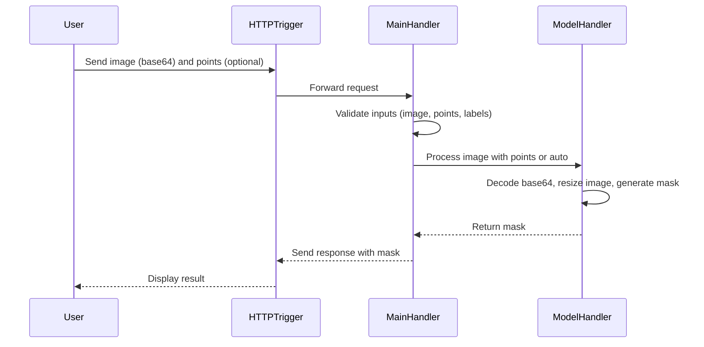

# CVAT - Configuração Customizada do SAM 2 para GPUs com Pouca VRAM

Este documento descreve a configuração customizada do SAM 2, localizada em `sam2/nuclio/` dentro desta pasta (`sam2_custom/`), usada para segmentar a imagem `dog.jpg` (5184x3888 pixels) no CVAT com uma GTX 1050 Ti (3.93 GiB VRAM). Ele detalha as modificações feitas nos arquivos `main.py`, `model_handler.py`, e `function-gpu.yaml` em relação aos originais (em `../sam2/nuclio/`), explica os motivos dessas mudanças, e fornece instruções para implantação e teste.

## 📂 Estrutura da Pasta

A pasta `sam2/nuclio/` contém os arquivos modificados otimizados para GPUs com pouca VRAM:

```
sam2/
└── nuclio/
    ├── function-gpu.yaml  # Configura `sam2_hiera_tiny.pt`, `opencv-python`, `sam2_hiera_t.yaml`
    ├── main.py            # Suporta base64, segmentação automática, validações
    ├── model_handler.py   # Usa `SAM2AutomaticMaskGenerator`, redimensionamento, `torch.cuda.empty_cache()`
```

## 🔧 Modificações nos Arquivos

Os três arquivos originais (`main.py`, `model_handler.py`, `function-gpu.yaml`) em `../sam2/nuclio/` foram modificados para viabilizar o SAM 2 na GTX 1050 Ti e garantir compatibilidade com o CVAT. Abaixo estão as mudanças:

### 1. `main.py`
- **Original** (`../sam2/nuclio/main.py`):
  - Usava `PIL` para processar imagens, exigia `pos_points` e `neg_points`.
  - Sem suporte a segmentação automática.
  - Sem validações robustas para entradas nulas ou incompatíveis.
- **Modificado** (`sam2/nuclio/main.py`):
  - Suporta imagens em base64 com `cv2.imdecode` para maior eficiência.
  - Inclui segmentação automática (sem pontos ou caixa) para requisições do CVAT sem `pos_points`/`neg_points`.
  - Adiciona validações para garantir que `image` seja fornecida e que `points` e `labels` sejam compatíveis.
- **Motivo**:
  - Evitar erros com requisições do CVAT sem pontos.
  - Reduzir consumo de memória em comparação com `PIL`.
  - Garantir robustez contra entradas inválidas.

### 2. `model_handler.py`
- **Original** (`../sam2/nuclio/model_handler.py`):
  - Usava `SAM2ImagePredictor` com `sam2_hiera_large.pt` (~8-12 GB VRAM).
  - Processava imagens na resolução nativa, sem redimensionamento.
  - Exigia `pos_points`/`neg_points`, sem suporte a segmentação automática.
  - Não liberava memória.
- **Modificado** (`sam2/nuclio/model_handler.py`):
  - Trocou `SAM2ImagePredictor` por `SAM2AutomaticMaskGenerator` para suportar segmentação automática.
  - Usa `sam2_hiera_tiny.pt` (~2-3 GB VRAM).
  - Redimensiona imagens para 256x256 (ou 128x128) com `cv2.resize`.
  - Libera memória com `torch.cuda.empty_cache()`.
  - Suporta base64 com `cv2.imdecode`.
- **Motivo**:
  - Reduzir VRAM para caber na GTX 1050 Ti.
  - Compatibilizar com requisições sem pontos.
  - Processar imagens grandes (ex.: 5184x3888) sem erros de `CUDA out of memory`.

### 3. `function-gpu.yaml`
- **Original** (`../sam2/nuclio/function-gpu.yaml`):
  - Configurava `sam2_hiera_large.pt`.
  - Não instalava `opencv-python` nem baixava `sam2_hiera_t.yaml`.
  - Sem `PYTORCH_CUDA_ALLOC_CONF`.
- **Modificado** (`sam2/nuclio/function-gpu.yaml`):
  - Usa `sam2_hiera_tiny.pt`.
  - Instala `opencv-python`.
  - Inclui download do `sam2_hiera_t.yaml`.
  - Configura `PYTORCH_CUDA_ALLOC_CONF=expandable_segments:True`.
- **Motivo**:
  - Viabilizar o modelo na GTX 1050 Ti.
  - Suportar `cv2` para redimensionamento.
  - Fornecer configuração do modelo `tiny`.
  - Evitar fragmentação de memória.

## 🚀 Como Implantar

Os arquivos modificados já estão em `sam2/nuclio/` nesta pasta (`sam2_custom/`). Siga os passos para implantar a função SAM 2 customizada:

1. **Implantar a Função**:
   - Remova a função existente:
     ```bash
     nuctl delete function sam2-tce --namespace cvat
     ```
   - Limpe o cache do Docker:
     ```bash
     docker builder prune -f
     ```
   - Implante a função:
     ```bash
     cd cvat/sam2_custom
     ./deploy_gpu.sh sam2/nuclio --build
     ```
   - Reinicie o CVAT:
     ```bash
     docker compose -f docker-compose.yml -f docker-compose.serverless.yml -f docker-compose.custom.override.yml restart
     ```
   - Verifique os logs:
     ```bash
     docker logs $(docker ps -q --filter "name=nuclio-sam2")
     ```

2. **Testar**:
   - Suba uma imagem pequena para o MinIO:
     ```bash
     convert /mnt/share/images/dog.jpg -resize 128x128 dog_tiny.jpg
     mc cp dog_tiny.jpg myminio/cvat-storage/
     ```
   - Crie uma tarefa no CVAT (`http://192.168.1.15:8080`):
     - Nome: `Teste SAM2 Custom`
     - Label: `dog` (tipo: polygon)
     - Source Storage: **Cloud Storage** > `minio-cvat-storage`, selecione `dog_tiny.jpg`
     - Clique em **Submit & Open**.
     - No job, use a ferramenta **Polygon**, clique em **Interact** (varinha mágica) ou pressione **M**, escolha `nuclio-sam2`, clique em pontos no cachorro, e clique em **Apply**.
     - Salve e exporte as anotações em **Actions > Export annotations** (formato CVAT XML).
   - Verifique o XML para confirmar a máscara `semi-auto` e possíveis bounding boxes `auto`.

## 📈 Diagrama de Sequência



## 🛠️ Resolução de Problemas

### 1. Erro `CUDA out of memory`
- **Causa**: VRAM insuficiente na GTX 1050 Ti (3.93 GiB).
- **Solução**:
  - Verifique o uso da GPU:
    ```bash
    nvidia-smi
    ```
  - Mate processos desnecessários:
    ```bash
    sudo kill -9 <PID>
    ```
  - Use imagens pequenas:
    ```bash
    convert /mnt/share/images/dog.jpg -resize 128x128 dog_tiny.jpg
    mc cp dog_tiny.jpg myminio/cvat-storage/
    ```
  - Reinicie o Docker se necessário:
    ```bash
    sudo systemctl restart docker
    docker compose -f docker-compose.yml -f docker-compose.serverless.yml -f docker-compose.custom.override.yml up -d
    ```

### 2. Modelo Não Aparece no Menu
- **Causa**: Função não registrada no Nuclio ou falha no deploy.
- **Solução**:
  - Confirme funções ativas:
    ```bash
    nuctl get functions --namespace cvat
    ```
  - Reimplante:
    ```bash
    nuctl delete function sam2-tce --namespace cvat
    ./deploy_gpu.sh sam2_custom/sam2/nuclio --build
    ```

### 3. Bounding Box `auto` Inesperada
- **Causa**: O CVAT pode gerar bounding boxes `auto` a partir de máscaras `semi-auto`, como observado no teste com `dog.jpg`.
- **Solução**:
  - Verifique funções ativas para descartar outros modelos:
    ```bash
    nuctl get functions --namespace cvat
    ```
  - Cheque os logs do CVAT:
    ```bash
    docker logs cvat_server | grep -i auto
    ```
  - Crie uma nova tarefa com uma imagem pequena para confirmar:
    ```bash
    convert /mnt/share/images/dog.jpg -resize 128x128 dog_tiny2.jpg
    mc cp dog_tiny2.jpg myminio/cvat-storage/
    ```
  - Se preferir apenas máscaras, ajuste as configurações da tarefa no CVAT para desativar bounding boxes automáticas.

### 4. Erro `HTTPConnectionPool(host='host.docker.internal', port=...)`
- **Causa**: CVAT usa `host.docker.internal` em vez do IP interno.
- **Solução**:
  - Edite `docker-compose.serverless.yml` na raiz:
    ```yaml
    services:
      cvat_server:
        environment:
          - CVAT_SERVERLESS=1
          - NUCLIO_FUNCTION_ENDPOINT=http://172.20.0.5:8070/api/functions
          - CVAT_LAMBDA_ENDPOINT=http://172.20.0.25:8080
    ```
  - Reinicie:
    ```bash
    docker compose -f docker-compose.yml -f components/serverless/docker-compose.serverless.yml -f docker-compose.custom.override.yml down
    docker compose -f docker-compose.yml -f components/serverless/docker-compose.serverless.yml -f docker-compose.custom.override.yml up -d
    ```

## 📚 Referências

- [Segment Anything 2](https://github.com/facebookresearch/segment-anything-2)
- [CVAT Docs](https://docs.cvat.ai/)
- [Nuclio Docs](https://nuclio.io/docs/latest/
